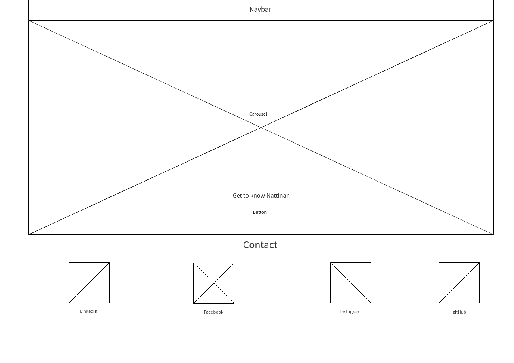
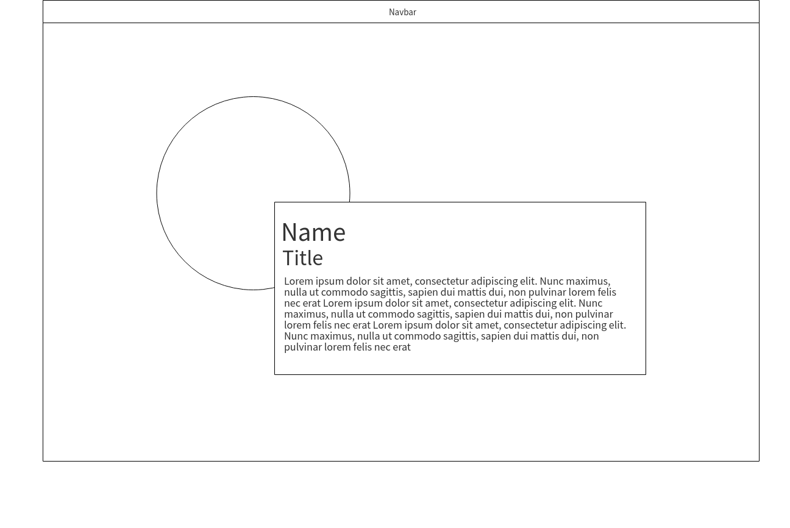
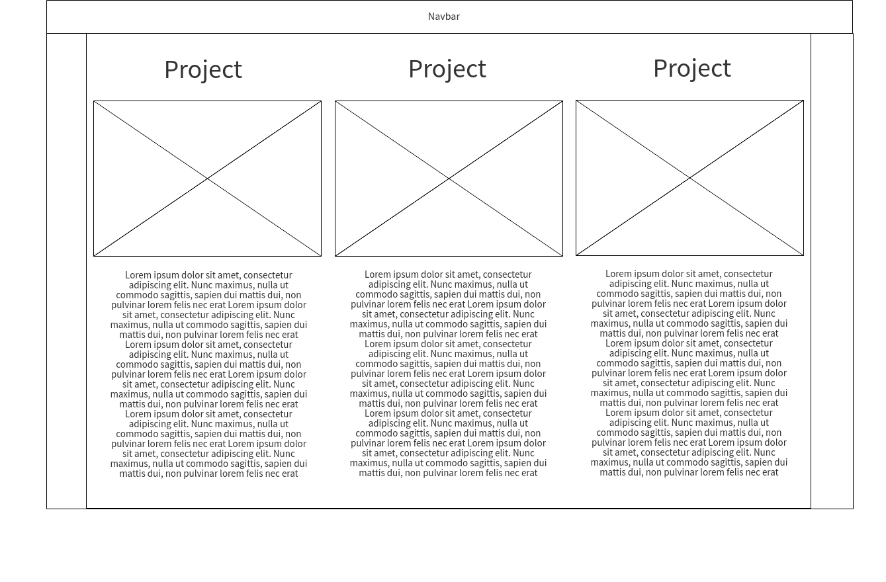
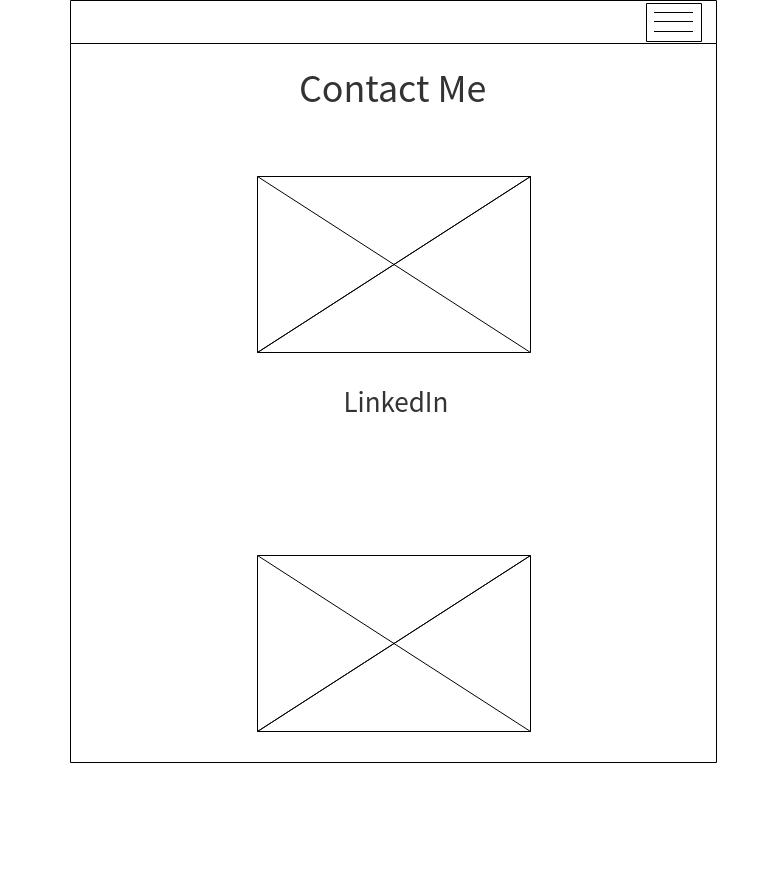
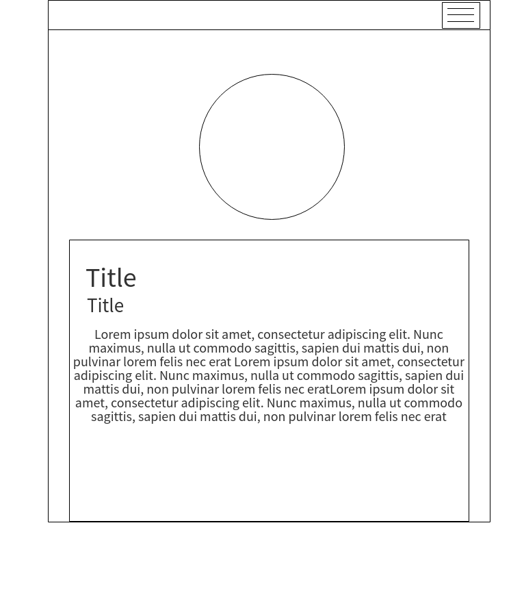
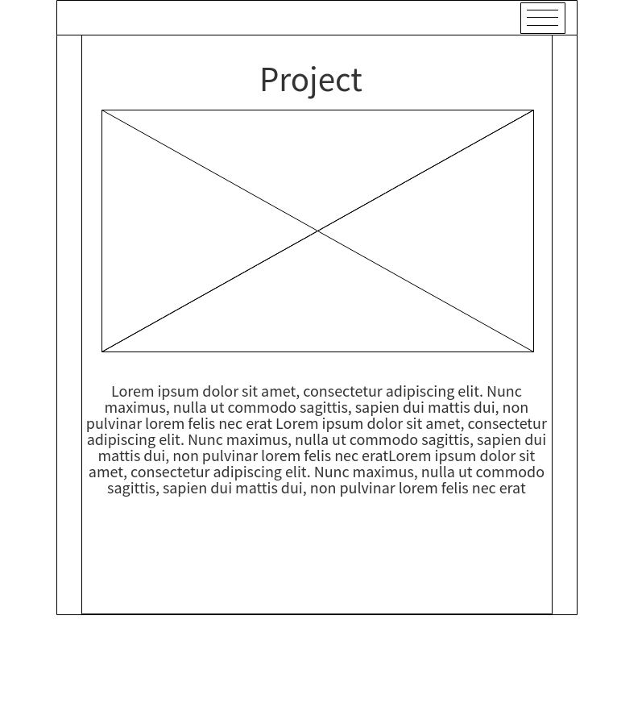
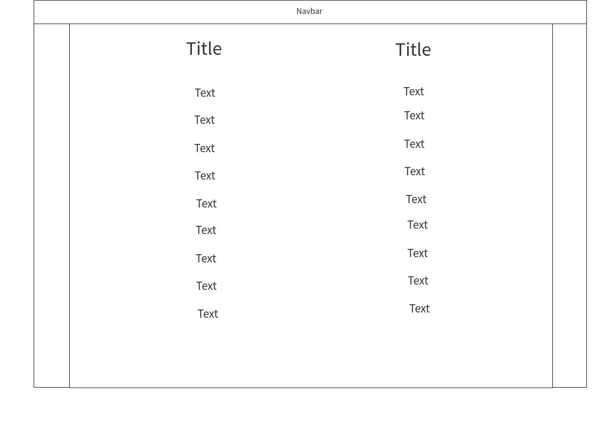

# Portfolio
* Bootstrap
* Grid Layout
* Mobile first
* Bootstrap Navigation
* Google fonts
* Glyphicons (Fontawesome)
* background
* gitHub Page
---
# User Story
### Wireframe
All the pages will have a navigation bar at the top of the page in a normal PC-screen mode.

For the homepage, I want to have it as an introduction to my portfolio. So, I looked into Bootstrap, what were available to be used and implemented, and decided to create a carousel for my homepage.  

The user will be able to see the carousel displaying my profile image, and a button "Go", which will take the user to my "About Me" page. The next slide on the carousel will take the user to "Portfolio" page, and the last slide will take the user to "Skills" page.  
And at the bottom of the page, there will be some options for the user to contact me i.e. via LinkedIn, Facebook, Instagram and gitHub.  

The next page is "About Me".

The navigation bar will remain at the top of the page. This page will simply display my profile image and a summary paragraph about myself.

The next page will be "portfolio" page.

  

This page will also have the navigation bar at the top. It will have a few example of some of the projects I have available for public access on gitHub. The images will be a screenshot of the product created for that project, and when you click on the image, it should take the user to my gitHub repository of that project.  
Underneath each images will be the summary description of that project. This is where the Bootstrap gridlayout will be utilised.

The next page will be "Skills".

Te page will display a list of technical skills and professional skills, left and right, respectively. This is where Fontawesome will get utilised. The navigation bar will remained at the top.

The last page will be "Contact".  
It will be link back to the homepage since that's where the contact options are.

---  
### Responsive mode

The navigation bar will be minimised and collapsed down into a small button, as shown below.

The carousel will disappear completely, leaving only the contact information there.

The same goes for the rest of the pages. Everything will appear as "one-column".

---
### Google fonts

Using font-family: Changa 

---
